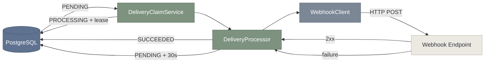

# Relay Engine


Durable webhook delivery in Java and Spring Boot.

**Claim safely. Deliver over HTTP. Retry durably.**




## Delivery state

```text
PENDING
   |
   | claim
   v
PROCESSING
   |
   +---- 2xx --------> SUCCEEDED
   |
   +---- failure ----> PENDING
                       retry after 30s
```

Claims use PostgreSQL row locking:

```sql
FOR UPDATE SKIP LOCKED
```

A claim increments `attempt_count` and creates a processing lease. Success and retry transitions are guarded so only `PROCESSING` deliveries can leave the processing state.

The claim transaction is committed before the outbound HTTP request:

```text
claim -> commit -> HTTP POST -> state update
```

No database transaction is held open while waiting on the remote endpoint.

## Stack

Java 21 · Spring Boot 4 · Spring JDBC · RestClient · PostgreSQL · Flyway · Testcontainers · JUnit · Maven

## Test

```bash
./mvnw test
```

Windows:

```bat
mvnw.cmd test
```

Tests cover PostgreSQL persistence, concurrent claiming, delivery state transitions, HTTP transport, successful delivery, and retry scheduling.

## Current scope

Implemented:

- PostgreSQL-backed delivery persistence
- transactional claiming and leases
- concurrent worker safety
- HTTP webhook delivery
- successful completion
- fixed-delay retry
- integration testing with Testcontainers

Next: lease recovery, retry limits, backoff, and worker scheduling.